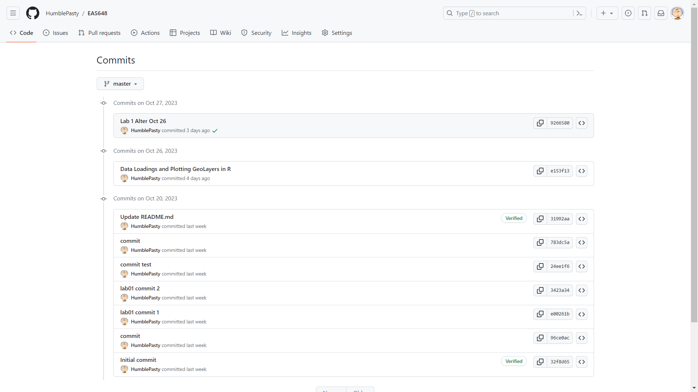

```{r setup, include=FALSE}
knitr::opts_chunk$set(echo = TRUE)
setwd("D:/UMich/Fall23/EAS648/Repo/Lab/01")
```


# Part I: Tutorials form class

> This sections mainly focus on following the instructions of the lab tutorial and trying out all the code.

## Loading lib

```{r}
library(ggplot2)
library(sf)

library(tidyverse)

library(ggspatial)
library(grid)

library(cowplot)
```

## Start Loading Data

```{r}
boulder = st_read("Data/BoulderSocialMedia.shp")

head(boulder)
```

## Plot the variables

```{r}
ggplot() +
    geom_sf(data =boulder, fill = NA, alpha = .2) +
    theme_bw()
```

## Reproject the data

> Project the data using an appropriate projection for Colorado. Use the epsg.io website for choosing the an appropriate projection

```{r}
# transforming the current projection
boulder = st_transform(boulder, 26753)
ggplot() +
    geom_sf(data =boulder,
    fill = NA, alpha = .2) +
    theme_bw()
```

## Changing Symbologies

> Adding ‘Gradient colour scales’ in ggplot2. Here is the documentation of these options https://ggplot2.tidyverse.org/reference/scale_gradient.html.

```{r}
# show elevation in color based on PT_Elev field
ggplot() +
    geom_sf(data =boulder, aes(color=PT_Elev),
    fill = NA, alpha = .2) +
    theme_bw()
```

## Using another color scale:

```{r}
# using scale_colour_gradientn
ggplot() +
    geom_sf(data =boulder, aes(color=PT_Elev),
    fill = NA, alpha = .2) +
  scale_colour_gradientn(colours = terrain.colors(10)) +  
  theme_bw()
```


## Select Data

```{r}
# library(dplyer)
boulder %>%
    mutate(high_elev = ifelse(PT_Elev >= 2200, TRUE, FALSE))%>% 
ggplot() +
  geom_sf(aes(color=high_elev),
    fill = NA, alpha = .2)  +  
  theme_bw()
```

## Create boxplot

```{r}
boulder %>%
  filter(DB ==  'Pano' | DB == 'Flickr') %>%
  ggplot(aes(x=DB, y=Street_dis)) + 
  geom_boxplot()
```


## Additional Tools


```{r}
library(sf)
library(ggspatial)
library(viridis)

ggplot() +
    geom_sf(data = boulder, aes(color=PT_Elev),
    fill = NA, alpha = .2) + 
    scale_colour_gradientn(colours = magma(10))

```

## Plot discrete values:
```{r}
summary(boulder$DB)

p <- ggplot() +
  annotation_spatial(boulder) +
  layer_spatial(boulder, aes(col = DB))
p + scale_color_brewer(palette = "Dark2")
```

## TMaps

```{r}
library(tmap)

## Add the data - these are specific to the vector or raster
tm_shape(boulder) + 
  ## which variable, is there a class interval, palette, and other options
  tm_symbols(col='PT_Elev', 
             style='quantile', 
             palette = 'YlOrRd',
             border.lwd = NA,
             size = 0.1)
```

## Adding interactive map

```{r}
## here we are using a simple dataset of the world 
# tmap_mode("plot")
data("World")
tm_shape(World) +
    tm_polygons("gdp_cap_est", style='quantile', legend.title = "GDP Per Capita Estimate")
```


# Part II: Assignment Tasks

## Questions: 

> Discuss the advantages and challenges associated with an open data science approach. Provide an example based on this week’s reading. (1-2 paragraphs)


Answer: 

> An open data science approach, as exemplified by the potential release of the extensive dataset from President Obama's election campaigns, offers several advantages. Firstly, it promotes transparency, which is fundamental in ensuring the credibility of research findings. This dataset, in particular, would offer invaluable insights into the intricate details of American societal, political, and economic dynamics, serving as a robust foundation for myriad research questions. Moreover, collaborative, open-source environments foster innovation, as they allow multiple researchers from diverse backgrounds to cross-pollinate ideas, refine methodologies, and advance knowledge at an accelerated pace.
>
> 
>
> However, such an approach is not without challenges. Chief among these is the risk of privacy breaches and potential misuse of sensitive information. Given that the dataset encompasses detailed personal information of voters, there's a possibility that the data could be de-anonymized, violating individual privacy rights. Additionally, the sheer volume and complexity of open datasets can often lead to misinterpretation or misleading conclusions, especially when handled by those without the necessary domain expertise. Lastly, concerns related to data quality, accuracy, and bias can emerge, especially when integrating data from various sources like commercial data aggregators and social media sites. Ensuring consistent data integrity and addressing inherent biases would be crucial to derive meaningful and trustworthy insights.


## Creating a Map

> Task: Create a markdown document that showcases an analysis of this week’s data or any other dataset of your choice. Include descriptive text that explains your analysis, and incorporate figures and geovisualizations.

Answer:

> For the labs assignment, I continue to use the boulder dataset.

> Map Goal: Create a interest map for tourists, high light all the points that is within 50 meters of climbing wall, Natural Landmark or prairie dog mounds

```{r}

# Step 1: create a new column indicating the nearest POI type
main_plot = boulder %>%
    mutate(
      near_poi = case_when(
        Climb_dist <= 50 ~ "Climing Wall",
        NatMrk_Dis <= 50 ~ "Natural Landmark",
        PrarDg_Dis <= 50 ~ "Prairie Dog Mounds",
        TRUE ~ "Other")
     )%>%

# using ggplot to plot the map
ggplot() +
  geom_sf(aes(color=near_poi),
    fill = NA)  +  
  
  # adding title
  ggtitle("Tourist Map of Interest in Boulder, Colorado") + 
  
  # altering the legend title
  labs(color = "POI In 50 Meters:") +
  
  # adding scale bar
  annotation_scale(location = "br", width_hint = 0.5) +
  
  # adding north arrow
  annotation_north_arrow(location = "tr", which_north = "true", 
                         style = north_arrow_fancy_orienteering()) +
  # adding theme: bw
  theme_bw()

# Create grobs annotation
label_text <- "Author: Haolin Li\nGCS: NAD 1983\nPCS: NAD27/Colorado North\nDate: 10/29/2023"
text_grob <- textGrob(label = label_text, 
                     hjust = 1, vjust = 0, 
                     gp = gpar(fontsize = 4))

text_grob <- editGrob(text_grob,x = unit(0.99, "npc"), y = unit(0.08, "npc"))

# adding annotaion to main plot
main_plot <- main_plot + 
  annotation_custom(grob = text_grob)

# print the map with annotation
print(main_plot)

```


## Tourist attractiveness score map

> Here I want to create a second plot for showing how attractive a point is to tourists. To calculate the score, I used the following method:
> The score of each points adds 10 for each condition it meets:
>
> - Within 10 meters of Climbing Wall
> - Within 10 meters of Natural Landmark
> - Within 10 meters of Prairie Dog Mounds

```{r}
# Step 2: create a new column to score the attractiveness
main_plot = boulder %>%
  mutate(attr_score = 10 * ifelse(Climb_dist < 50, 1, 0) +
                     10 * ifelse(NatMrk_Dis < 50, 1, 0) +
                     10 * ifelse(PrarDg_Dis < 50, 1, 0)
         )%>%

# using ggplot to plot the map
ggplot() +
  geom_sf(aes(color=attr_score),
    fill = NA)  +  
  
  # adding title
  ggtitle("Attractiveness Score in Boulder, Colorado") + 
  
  # altering the legend title
  labs(color = "Score") +
  
  # adding scale bar
  annotation_scale(location = "br", width_hint = 0.5) +
  
  # adding north arrow
  annotation_north_arrow(location = "tr", which_north = "true", 
                         style = north_arrow_fancy_orienteering()) +
  # adding theme: bw
  theme_bw()

# Create grobs annotation
label_text <- "Author: Haolin Li\nGCS: NAD 1983\nPCS: NAD27/Colorado North\nDate: 10/29/2023"
text_grob <- textGrob(label = label_text, 
                     hjust = 1, vjust = 0, 
                     gp = gpar(fontsize = 4))

text_grob <- editGrob(text_grob,x = unit(0.99, "npc"), y = unit(0.08, "npc"))

# adding annotaion to main plot
main_plot <- main_plot + 
  annotation_custom(grob = text_grob)

# print the map with annotation
print(main_plot)
```

## Visualize the attribution of attractiveness score

```{r}
# Creating a pie chart to visualize the distribution of the score
# 假设您的数据框叫df
as_counts = table(mutate(boulder, attr_score = 10 * ifelse(Climb_dist < 50, 1, 0) +
                     10 * ifelse(NatMrk_Dis < 50, 1, 0) +
                     10 * ifelse(PrarDg_Dis < 50, 1, 0))$attr_score)

as_proportions = as_counts / sum(as_counts)

as_labels = paste(names(as_proportions), ": ", round(as_proportions*100, 2), "%", sep="")

pie(as_counts, main = "Pie Chart of Attractiveness Score", labels = as_labels)


```


## Analysing the Result:


> As we can see in the first and second map, Boulder is a place with abundant natural tourism resouces. Most of the attraction of comes from being inside or next to a natural landmark. With the natural landmarks are several climbing walls, which mainly exists in the center of the area. The southeastern part of the area also shows high attractiveness with interesting prairie dog mounds and second largest natural landmark. The pie chart shows that almost 15% of the points in this area is within the 50 meters radius of a tourist attraction.


## Bonus: Utilizing Git

> Task: Host a HTML of your RMD as a Website on GitHub

**Github repository**: https://github.com/HumblePasty/EAS648


### Screenshot of Commits:




### Github Webpage of the Project:
 
**Visit My EAS-648 Webpage**:https://humblepasty.github.io/EAS648/


